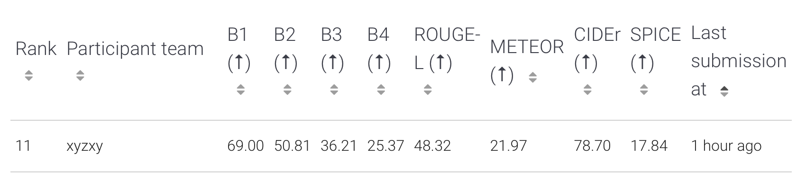

# DS598 DL4DS Midterm Project
Xinyu Zhang

## Introduction
This project aims to train a network to generate captions for the 
[VizWiz Image Captioning dataset](https://vizwiz.org/tasks-and-datasets/image-captioning/).
The images are taken by people who are blind and typically rely on
human-based image captioning services. 

## Results

CIDEER
Training logs with detailed scores for each epoch are provided in `demo_train.sh.e5693712` and `demo_train.sh.o5693712`

## Model
This project employs the [blip-image-captioning](https://huggingface.co/Salesforce/blip-image-captioning-base) models, which is a set of pre-trained model specifically designed for image captioning tasks. It integrates visual and language understanding to generate relevant and context-aware captions.

### Optimization
- optimizer: AdamW
- learning rate: 1e-5


## File Structure
```plain text
src/base/           Initialization
- constants.py              # Sets up environmental paths for data and libraries
- dataset.py                # Defines the custom dataset class for VizWiz data
- helpers.py                # Contains the Vocabulary and Logger utility classes
- vizwiz_api.py             # API class for VizWiz data 

src/cnn_lstm/       Example scripts for a CNN-LSTM model approach

src/demo_model/     My training process
- dataset.py                # Custom dataset for the demo model
- test.py                   # Script for testing the demo model
- train.py                  # Training script for the demo model

Shell Scripts
- cnnlstm_train.sh              # Shell script to train the CNN-LSTM model
- cnnlstm_test.sh               # Shell script to test the CNN-LSTM model
- demo_train.sh                 # Shell script to train the demo model
- demo_test.sh                  # Shell script to test the demo model

Log files

git/examples/       Results
```

## Developer Setup
Clone this repo to your directory.

### Create Shell files
Once you have a training script setup, create a shell script, e.g. `train.sh`,
that loads and activates a conda environment and then runs your training
script. An example shell script is below. Please modify it if you want it run locally.

```sh
#!/bin/bash -l

# Set SCC project
#$ -P ds598

# load and activate the academic-ml conda environment on SCC
module load miniconda
module load academic-ml/spring-2024
conda activate spring-2024-pyt

# Add the path to your source project directory to the python search path
# so that the local `import` commands will work.
export PYTHONPATH="/projectnb/ds598/students/<userid>/<yourdir>:$PYTHONPATH"

# Update this path to point to your training file
python path/to/train.py

# After updating the two paths above, run the command below from an SCC
# command prompt in the same directory as this file to submit this as a
# batch job.
### qsub -pe omp 4 -P ds598 -l gpus=1 train.sh
```
### Result Save Path
Change the result save path in `src/base/constants.py`
```python
# line 8
BASE_DIR = "/projectnb/ds598/students/xyz0906/sp2024_midterm/"
```
### Dataset Path

The dataset is downloaded to 
`/projectnb/ds598/materials/datasets/vizwiz/captions`. In this repo the path has already been defined in the accompanying code. If you want to run it locally, change the path of dataset in `constants.py`.
```python
# line 11
DATA_BASE_DIR = "/projectnb/ds598/materials/datasets/vizwiz/captions/"
```

## Run Scripts

When you run the example scripts, make sure to add the path to the repo
folder before running the script. 

```export PYTHONPATH=".../path/to/folder:$PYTHONPATH"```

The example shell scripts include this command.


Set the paths in `src/base/constants.py` to the correct paths on your system.

Follow the .sh files to run the code. As an example, to run the `cnnlstm_train.sh`
script, you would run at the command prompt from the base of your local repo folder:

```sh
$ qsub -pe omp 4 -P ds598 -l gpus=1 cnnlstm_train.sh
Your job 5437870 ("cnnlstm_train.sh") has been submitted
```
After training process, run `{model}_test.sh` to generate test results.

## Evaluation

In the VizWiz challenge evaluation they refer to five different evaluation
metrics although they use CIDr-D as their primary evaluation.

They reference the BLUE metric, but there are limitations to that metric as
described in [2] below.

### Validation Results

Validation set results are reported in the CNN-LSTM example and code for reporting validation results are in the demo model code.

### Test Results

As is typically the case, the test dataset labels are withheld, and so the only way to get test results is to produce predicted captions and
then submit them to the VizWiz Image Captioning [Evaluation Server](https://eval.ai/web/challenges/challenge-page/739/overview). There are
scripts in both model directories to create the test submission file, although the demo model test script will have to be updated with model 
information.


## References

1. [CIDEr: Consensus-based image description evaluation](https://ieeexplore.ieee.org/document/7299087)
2. [BLEU: A Misunderstood Metric from Another Age](https://towardsdatascience.com/bleu-a-misunderstood-metric-from-another-age-d434e18f1b37), Medium Post
3. [BLEU Metric](https://huggingface.co/spaces/evaluate-metric/bleu), HuggingFace space
